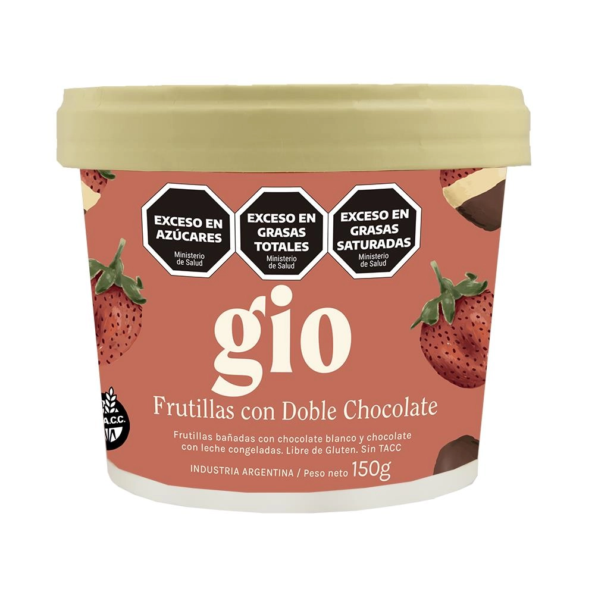

# Pagina Marleados
Eh creado una página de heladeria, una especie de menú, con las imagenes y los precios de cadad producto, al momento de realizarlo la estrucutra será siguiente:
```sh
<body>

    <header> # encabezado
      <h1>Marelados</h1>
    </header>

    <main> # todo el contenido
      #ejemplo:
      <h2>g i o</h2> # subtitulo
      <div class="helados-image"> # un contenedor con una clase para luego trabajar con ella
        <figure>
           #imagen
          <figcaption>Frutillas Con Doble Chocolate Gio 150g <br>- Precio: $4200</figcaption> #texto debajo de la imagen
        </figure>
      </div>
      
    </main>
    
    <footer> </footer> # pie de página
    
    <script type="module" src="/src/main.js"></script> # invocacion del main.js
  </body>
```

## Dando diseño
Al momento de dar diseño, me eh importdo tipografías, imágenes, trabajé con los tamaños de estos, sombras, colores:
```sh
@import url('https://fonts.googleapis.com/css2?family=Averia+Libre:ital,wght@0,300;0,400;0,700;1,300;1,400;1,700&family=Bowlby+One&family=Sour+Gummy:ital,wght@0,100..900;1,100..900&family=Squada+One&display=swap');

*{
    box-sizing: border-box;
    margin: 0; # elimino margenes
}

:root{ # aqui es donde creo los colores para luego al momento de usarlos, utilizo el var()
    --colorFondo: #f7d6e0;
    --colorBody: #eff7f64f;
    --colorMain: #eff7f6;
    --colorTitulo: #7bdff2;
    --colorLetraTitulo: #f7d6e0;
    --colorLetraSubtitulo: #f2b5d4;
    --colorSubtitulo: #b2f7ef;
    --colorBorde: #7bdff2;
}

html{
    background-image: url(/2638332_dessert_food_icecream_melting_sweet_icon.png); # coloqué iconos de fondo
    background-color: var(--colorFondo); # le di color al fondo
}

header{
    text-align: center; # centro el titulo
    background-color: var(--colorTitulo);
    color: var(--colorLetraTitulo);
    text-shadow: 1px 3px 5px black; # sombra del texto
}

body{
    background-color: var(--colorBody); # gracias a esto opaqué el constraste de los iconos que hay de fondo, para eso tuve que poner un color arriba y hacerlo medio transparente.
}

main{
    font-family: "Averia Libre", system-ui;
    justify-content: center;

    max-width: 700px; # se puede extender a los anchos hasta 700px
    margin: auto; # se centra
    margin-top: 30px; # espacio en el margen de arriba
    padding: 10px; # relleno

    background-color: var(--colorMain);
    border-radius: 15px; # elimino las esquinas puntiagudas, con esto las redondeos
    box-shadow: 1px 1px 10px 5px black; # sombra de la caja
}

h1{
    font-family: "Bowlby One", sans-serif;
    font-size: 40px; # tamaño de letra
    letter-spacing: 3px; # espacio entre las letras
    padding: 15px;
}
h2{
    font-size: 25px;
    letter-spacing: 2px;
    text-align: center; # centro el texto
    color: var(--colorLetraSubtitulo);
    text-shadow: 0 0 2px black;

    width: 150px; # ancho
    margin: 15px 0 15px 10px; # arriba 15px, derecha 0, abajo 15px, izquierda 10px
    padding: 2px;

    background-color: var(--colorSubtitulo);
    border: 3px solid var(--colorBorde); # grosor, estilo y color del borde
    border-radius: 10px;
}

img{
    width: 200px; # ancho de la imagen
    border-radius: 20px;
    box-shadow: 1px 1px 5px 2px black;
}
figcaption{
    font-family: "Sour Gummy", serif; # tipografia del texto debajo de la imagen
    font-size: 12px; 
    margin-top: 10px; # espacio en el margen de arriba 
}

footer{
    background-color: var(--colorTitulo);
    font-family: "Squada One", serif;
    font-weight: normal; # grosor del texto
    font-size: 11px;
    margin-top: 30px;
}
footer ul{
    display: flex; 
    justify-content: space-between; # generaré espacios entre las imagenez pero no desde su inicio y final
    flex-wrap: wrap; # si no hay espacio en la linea horizontal, los elementos se colocarán debajo

    list-style: none; # quito los items de la lista desordenada
    margin: 0;
    padding: 0;
}
footer li{
    padding: 0 10px;
}

.helados-image{
    display: flex;
    flex-wrap: wrap;
    align-items: center; # centro las imagenes verticalmente
    justify-content: center; # centro los elementos hijos en el centro del contenedor a lo largo del eje principal
    gap: 15px; # brecha, espacio entre las imágenes
}
```

## Navegacion y scroll-behavior
En el elemento header eh agregado una lista para navegar a las secciones que se encuentran en la página:
```sh
<header>
      <h1>Marelados</h1>
      <p class="texto-encabezado">(Trabajamos con productos de Grido y gio)</p>
      <nav>
        <ul>
          <li><a href="#gio">gio</a></li>
          <li><a href="#bombones">Bombones</a></li>
          <li><a href="#sin-tacc">Sin TACC</a></li>
          <li><a href="#tentacion">Tentacion</a></li>
          <li><a href="#postres">Postres</a></li>
          <li><a href="#tortas">Tortas</a></li>
          <li><a href="#familiar">Familiar</a></li>
        </ul>
      </nav>
</header>
```
* Los signos # son id que se encuentran en los elementos h2, que vendrían ser los subtitulos. Al momento de seleccionarlos aparecia de golpe en la seccion que se eligio, entonces utilicé un scroll-behavior, este hará que tenga una animación de bajada cuando se seleccione una palabra de la lista:
```sh
html{
    scroll-behavior: smooth;
}
```
## Animacion de cambio de color en la navegacion:
Otra cosa que hice en las listas del elemento nav, fue que actuen con cambios de color dependiendo de la accion que tengan:
```sh
a{
    text-decoration: none;
    letter-spacing: 3px; # espacio entre las letras
}

a:link{
    color: var(--colorLink);
}
a:visited{
    color: var(--colorVisited);
}
a:hover{
    color: var(--colorHover);
    text-decoration: none; # elimino la linea debajo de la palabra
}
a:active{
    color: var(--colorActive);
}
```

## Actualización 1
Se le agregó un fondo a la barra de navegación y se ajustó un poco el tamaño de header, otra cosa que se agregó fue el position:
```sh
header{
    width: 100%; # ocupará el ancho total de la pantalla
    position: fixed;
    top: 0;
}
```

## Con Stock y Sin Stock
Eh agregado elementos "p" y con clases, a esto le asigne colores verdes y rojos
```sh
# html
<p class="con-stock">con Stock</p>
<p class="sin-stock">¡¡¡Sin Stock!!!</p>

# css
.sin-stock{
    color: var(--colorSinStock); #rojo
}
.con-stock{
    color: var(--colorHayStock); #verde
}
```

## Actualización 2: seleccion para palitos helados
Dentro del menú (la barra que se encuentra arriba), eh agregado una lista más con un elemento de anclaje que te dirige a la seccion de helados palitos:
```sh
  <nav>
    <ul>
      <li><a href="#palitos-helados">Palitos</a></li>
    </ul>
  </nav>

  <h2 id="palitos-helados">Helados Palitos</h2>
```

## Actualización 3

### Adaptando a dispositivos chicos
Al momento de adaptar imágenes y tamaño del titulo para celulares, lo realicé con @media:
```sh
@media (max-width: 600px) {
    img {
        width: 150px;
    }
    h1 {
        font-size: 24px;
    }
    nav ul {
        flex-direction: flex;
    }
}
```

### Icono de whatsapp: trabajado con position
Eh agregado el icono de whatsapp, la finalidad de este es que el usuario seleccione este icono y lo mandará directamente al contocato, al icono lo encontrarás en l esquina derecha inferior de la página. Este icono te seguirá tanto cuando bajes como cuando subas, para lograrlo lo hice de la siguiente forma:
```sh
# html:
<main>
    <div class="fixed-icon">
        <a href="enlace-del-siguiente-sitio" target="_blank"></a>
    </div>
</main>

# css:
.fixed-icon{
    position: fixed;
    bottom: 10px; # abajo
    right: 10px; # hacia la derecha
}
.fixed-icon .icon{
    width: 50px; # ancho
    height: auto;
    border: none;
    box-shadow: none;
}

```
* Nota: el target="_blank" se encargará de abrirte otra pestaña, la finalidad de este es para que no se le quite la página al usuario en la misma pestaña, yo quiero que siga conservando el lugar en el que se encuentra y cuando seleccione el icono, se abra otra pestaña nueva.

## Actualización 4: correcciones con la clase centro
Noté dos imagenes en la seccion de "Tentación" que no estaban correctamente alineadas, lo solucioné con la clase centro:
```sh
<div class="centro">
  <figure>
    
    <figcaption>Sabor Chocolate con Almendras <br>- Precio: $5400</figcaption>
    <p class="con-stock">con Stock</p>
  </figure>
</div>

<div class="centro">
  <figure>
    
    <figcaption>Sabor Dulce de Leche Granizado <br>- Precio: $5400</figcaption>
    <p class="con-stock">con Stock</p>
  </figure>
</div>
```
